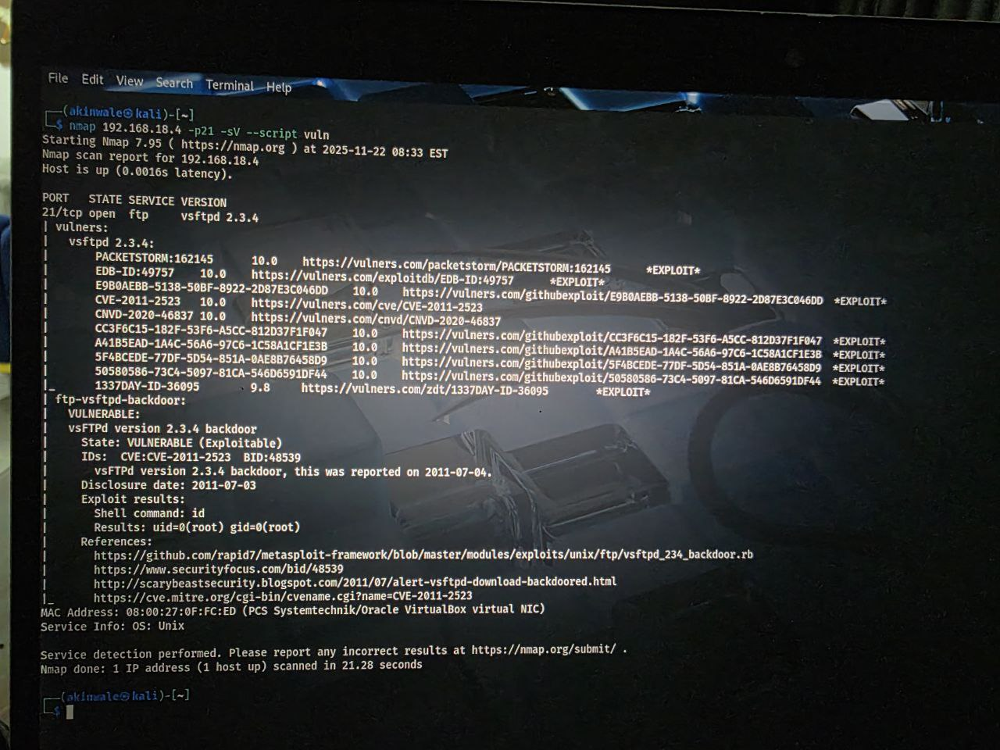

# metasploitable-Security-Assessment
comprehensive penetration test report of metasploitable VM demonstrating vulnerability assessment, exploitation verification, and security analysis using  Nmap and NSE scripts
# Detailed Technical Report

## Penetration Testing Report

Target IP: 192.168.18.4
Scan Date: 2025-11-22
Tester: aldima1e9/aktimalc
Objective: External Vulnerability Assessment

---

### 1. Executive Summary
The target host 192.168.18.4 was found to be highly vulnerable. It is running an outdated and poorly configured Linux system (Metasploitable) with multiple critical services exposed. A Critical-risk backdoor is present in the FTP service, allowing for immediate remote compromise.

Overall Risk Rating: CRITICAL

---

### 2. Methodology
1. Discovery: Initial TCP port scan (-p1-800) to identify accessible services
2. Enumeration: Service version detection (-sV) on open ports
3. Vulnerability Analysis: NSE scripts (--script vuln) to probe for known vulnerabilities

---

### 3. Detailed Findings

#### Port 21/tcp - FTP (vsftpd 2.3.4)
- Risk Rating: CRITICAL
- Evidence: ./ftp_service_02.jpg, 
- Vulnerability: CVE-2011-2523 - Backdoor command execution
- Verification: Nmap script confirmed root-level command execution
- Recommendation: Immediate service disablement and OS reinstallation

#### Port 22/tcp - SSH (OpenSSH 4.7p1)
- Risk Rating: HIGH
- Evidence: ../Evidence/sch_vulnerabilities_04.jpg
- Vulnerability: Multiple unpatched CVEs including remote code execution
- Recommendation: Upgrade to supported version, implement key-based auth

#### Port 23/tcp - Telnet (Linux telnetd)
- Risk Rating: HIGH
- Evidence: ../Evidence/telnet_service_05.jpg
- Vulnerability: Plaintext credential transmission
- Recommendation: Disable service, use SSH exclusively

#### Port 25/tcp - SMTP (Postfix)
- Risk Rating: MEDIUM
- Evidence: ../Evidence/snrip_vulnerabilities_06.jpg, ../Evidence/solver_analysis_07.jpg
- Vulnerabilities: 
  - SSL POODLE (CVE-2014-3566)
  - Weak Diffie-Hellman parameters (512-bit/1024-bit)
- Recommendation: Disable weak ciphers, implement strong encryption

---

### 4. Attack Path Analysis
1. Primary Vector: Exploit vsftpd backdoor for immediate root access
2. Secondary Vectors: 
   - Eavesdrop on Telnet for credential harvesting
   - Exploit outdated SSH service vulnerabilities
   - Target additional services (SMB, HTTP, RPC)

---

### 5. Remediation Strategy
1. Containment: Immediate network isolation
2. Eradication: Complete OS reinstallation from trusted media
3. Recovery: Build hardened system with minimal services
4. Hardening: 
   - Disable unnecessary services
   - Implement encrypted protocols only
   - Establish automated patching
   - Configure host-based firewall

---

### 6. Evidence Index
- Initial Scan: ../Evidence/intial_scan_01.jpg
- FTP Service: ../Evidence/tip_service_02.jpg
- FTP Backdoor: ../Evidence/tip_backdoor_explot_03.jpg
- SSH Vulnerabilities: ../Evidence/sch_vulnerabilities_04.jpg
- Telnet Service: ../Evidence/telnet_service_05.jpg
- SMTP Vulnerabilities: ../Evidence/snrip_vulnerabilities_06.jpg
- Cipher Analysis: ../Evidence/solver_analysis_07.jpg
